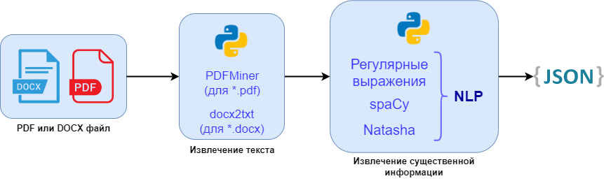

<h1 align="center">Web Resume Parser</h1>

## Description
### General description
The project combines the technologies of a classic client-server application and NLP tools.
### Web site
The main task of the website is to accept files (.pdf or .docx) from the user of resumes of
applicants in the IT field, then extract the main information from the resume using a parser
and bring it to a structured form.
After that, based on the received data, filters are formed, with the help of which the user
can select resumes according to certain criteria.
### Parser
The parser extracts information such as name, email, phone number, degree of education,
completed educational institutions, work experience, as well as a list of available
computer skills (programming languages, frameworks, etc.) and puts it in a JSON file.

## Getting Started
1. Clone this repository to your directory.
2. If necessary, change the database connection settings in the file [my.cnf](my.cnf).
3. Run the following commands:
   1. `python manage.py makemigrations`
   2. `python manage.py migrate`
4. Insert the data from the files in [resume/static/txt](resume/static/txt) into the appropriate tables and run the command:
   1. `python manage.py runserver`

## Technologies
### Backend
- Python 3.8 
- Django 4.0 
- MySQL 8.0
### Frontend
- HTML5 
- [Django template language](https://docs.djangoproject.com/en/4.0/ref/templates/language/)
- CSS3 
- JavaScript (jQuery)
### Parser (NLP)
- Regular expressions
- [spaCy](https://spacy.io/)
- [Natasha](https://github.com/natasha/natasha)

#### Parser schema

## Demonstration
